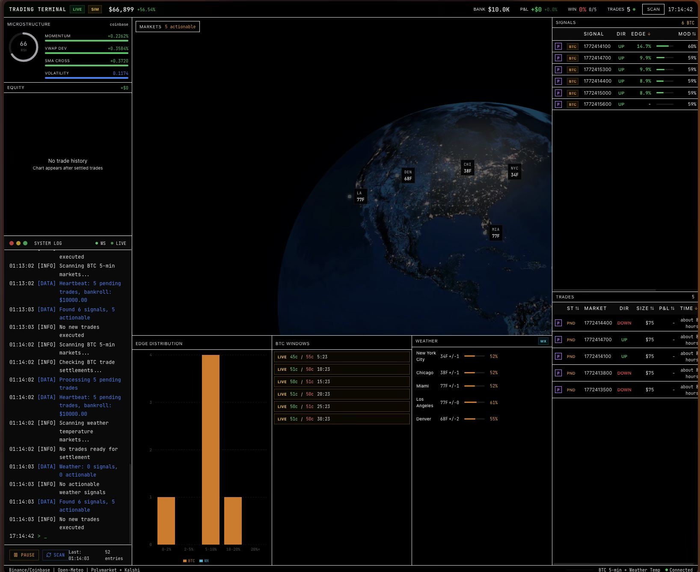
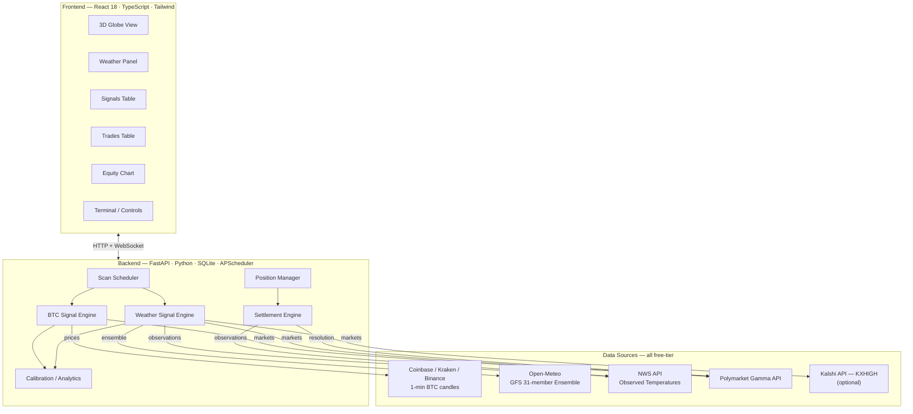

# Polymarket Weather Trading Bot

An automated trading bot that finds pricing inefficiencies in prediction markets by combining **ensemble weather forecasting** with **BTC microstructure analysis**. Trades weather temperature markets on **Polymarket** and **Kalshi**, with a live React dashboard.

    

<!-- Dashboard screenshot will go here -->
<!--  -->

> *Screenshot above: paper trading session — no real money was used.*

**100% free to run** — no paid APIs, no subscriptions required. All data sources are free-tier. Kalshi API key is optional.

---

## What It Does

The bot runs two independent trading strategies simultaneously:

### Strategy 1 — Weather Temperature Markets
Scans weather temperature markets on Polymarket (and optionally Kalshi) every 5 minutes. It fetches 31-member GFS ensemble forecasts from Open-Meteo and uses the fraction of ensemble members above/below a temperature threshold as a probability estimate. When that estimate diverges from the market price by more than 10%, it generates a trade signal.

**Cities tracked:** New York, Chicago, Miami, Los Angeles, Denver (configurable)

### Strategy 2 — BTC 5-Minute Up/Down
Scans Polymarket BTC 5-minute Up/Down markets every 60 seconds. Fetches real-time 1-minute candle data from Coinbase → Kraken → Binance (fallback chain) and computes RSI(14), momentum (1m/5m/15m), VWAP deviation, SMA crossover, and market skew. Trades when the composite signal edge exceeds 2%.

---

## Architecture



---

## Project Structure

```
polymarket-weather-trading-bot/
├── backend/
│   ├── api/
│   │   └── main.py               # FastAPI routes + WebSocket event stream
│   ├── core/
│   │   ├── signals.py            # BTC signal generation + composite scoring
│   │   ├── weather_signals.py    # Weather signal generation
│   │   ├── weather_strategy.py   # Strategy entry/exit logic
│   │   ├── position_manager.py   # Open position tracking
│   │   ├── scheduler.py          # Background scan jobs (BTC + weather)
│   │   ├── settlement.py         # Trade outcome settlement
│   │   └── analytics.py          # Calibration + performance metrics
│   ├── data/
│   │   ├── crypto.py             # BTC price + candle fetching (3-exchange fallback)
│   │   ├── weather.py            # Open-Meteo ensemble + NWS observation fetching
│   │   ├── weather_markets.py    # Polymarket weather market discovery
│   │   ├── btc_markets.py        # Polymarket BTC market fetching
│   │   ├── kalshi_client.py      # Kalshi API client (RSA-PSS auth)
│   │   ├── kalshi_markets.py     # Kalshi weather market fetching (KXHIGH)
│   │   ├── polymarket_prices.py  # CLOB price fetching
│   │   └── markets.py            # Generic market wrapper
│   ├── models/
│   │   └── database.py           # SQLAlchemy ORM models
│   ├── execution/
│   │   └── polymarket_executor.py # Real order execution via py-clob-client
│   ├── ai/
│   │   ├── claude.py             # Claude-based signal interpretation
│   │   ├── groq.py               # Groq LLM integration
│   │   ├── base.py               # LLM base class
│   │   └── logger.py             # Token cost tracking
│   └── config.py                 # All settings, overridable via env vars
├── frontend/
│   └── src/
│       ├── components/
│       │   ├── GlobeView.tsx          # 3D globe with city markers
│       │   ├── WeatherPanel.tsx       # Ensemble forecast per city
│       │   ├── CalibrationPanel.tsx   # Brier score + accuracy tracking
│       │   ├── MicrostructurePanel.tsx # RSI gauge + indicator meters
│       │   ├── EdgeDistribution.tsx   # Edge histogram
│       │   ├── StatsCards.tsx         # PnL + win rate cards
│       │   ├── SignalsTable.tsx        # Live BTC + Weather signals
│       │   ├── TradesTable.tsx         # Trade history
│       │   ├── EquityChart.tsx         # Equity curve (Recharts)
│       │   └── Terminal.tsx            # Event log + bot controls
│       ├── App.tsx                 # 3-column dashboard layout
│       ├── api.ts                  # Axios API client
│       └── types.ts                # TypeScript interfaces
├── .env.example                    # All required env vars (copy → .env)
├── requirements.txt
├── run.py                          # Single-process startup helper
├── Procfile                        # Railway deployment
└── vercel.json                     # Vercel frontend deployment
```

---

## Quick Start

### Prerequisites

- Python 3.10+
- Node.js 18+

### 1. Clone & Configure

```bash
git clone git@github.com:anuragak021/polymarket_weather_trading_bot.git
cd polymarket_weather_trading_bot

cp .env.example .env
# Edit .env — most fields have safe defaults for paper trading
```

### 2. Backend

```bash
python -m venv venv
source venv/bin/activate  # Windows: venv\Scripts\activate

pip install -r requirements.txt

uvicorn backend.api.main:app --reload --port 8000
```

- API: http://localhost:8000
- Swagger docs: http://localhost:8000/docs

### 3. Frontend

```bash
cd frontend
npm install
npm run dev
```

Dashboard: http://localhost:5173

---

## Configuration

All settings live in `backend/config.py` and can be overridden via environment variables (see `.env.example`).

### Core Strategy

| Variable | Default | Description |
|---|---|---|
| `STRATEGY_MODE` | `weather` | `weather` or `btc` |
| `SIMULATION_MODE` | `true` | Paper trading when true |
| `REAL_TRADING_ENABLED` | `false` | Safety gate for live orders |
| `INITIAL_BANKROLL` | `3` | Starting virtual bankroll ($) |

### Weather Strategy

| Variable | Default | Description |
|---|---|---|
| `WEATHER_MIN_EDGE_THRESHOLD` | `0.10` | Min edge to generate signal (10%) |
| `WEATHER_MIN_ENTRY_PRICE` | `0.40` | Min market price to enter |
| `WEATHER_MAX_ENTRY_PRICE` | `0.60` | Max market price to enter |
| `WEATHER_MIN_TRADE_SIZE` | `0.50` | Min $ per trade |
| `WEATHER_MAX_TRADE_SIZE` | `0.50` | Max $ per trade |
| `WEATHER_TAKE_PROFIT_PRICE` | `0.75` | Auto-exit threshold |
| `WEATHER_STOP_LOSS_PRICE` | `0.35` | Stop-loss threshold |
| `WEATHER_MAX_OPEN_TRADES` | `4` | Max concurrent positions |
| `WEATHER_CITIES` | `nyc,chicago,miami,los_angeles,denver` | Cities to scan |

### BTC Strategy

| Variable | Default | Description |
|---|---|---|
| `SCAN_INTERVAL_SECONDS` | `60` | BTC scan frequency |
| `MIN_EDGE_THRESHOLD` | `0.02` | Min edge (2%) |
| `MAX_ENTRY_PRICE` | `0.55` | Max entry price |
| `MAX_TRADE_SIZE` | `75.0` | Max $ per trade |
| `KELLY_FRACTION` | `0.15` | Fractional Kelly multiplier |

### Polymarket (Real Trading)

Leave blank for paper mode. Fill in only when you want live execution.

```env
POLYMARKET_PRIVATE_KEY=      # EVM wallet private key
POLYMARKET_API_KEY=
POLYMARKET_API_SECRET=
POLYMARKET_API_PASSPHRASE=
POLYMARKET_FUNDER_ADDRESS=
```

### Kalshi (Optional)

```env
KALSHI_API_KEY_ID=
KALSHI_PRIVATE_KEY_PATH=     # Path to RSA .pem file
KALSHI_ENABLED=false
```

---

## How It Works

### Weather Signal Generation

```
1. Fetch open temperature markets from Polymarket Gamma API
2. Fetch 31-member GFS ensemble forecast from Open-Meteo for each city
3. Count fraction of ensemble members above threshold → model probability
4. edge = model_prob - market_price
5. Signal fires when |edge| > WEATHER_MIN_EDGE_THRESHOLD
6. Position size = min(WEATHER_MAX_TRADE_SIZE, Kelly × bankroll)
```

**Example:** 28 of 31 ensemble members forecast > 70°F in NYC → model probability = 90%. Market shows 75¢ (75%). Edge = 15%. Signal fires: BUY YES.

### BTC Signal Generation

```
1. Fetch 60× 1-minute candles from Coinbase (fallback: Kraken, Binance)
2. Compute RSI(14), momentum (1m/5m/15m returns), VWAP deviation,
   SMA crossover (5/20), market book skew
3. Convergence filter: require 2+ of 4 directional indicators to agree
4. Weighted composite → UP probability in [0.35, 0.65]
5. edge = model_prob - market_price
6. Signal fires when |edge| > MIN_EDGE_THRESHOLD (2%)
```

### Kelly Position Sizing

```
kelly = (win_prob × odds − lose_prob) / odds
position = kelly × KELLY_FRACTION × bankroll
position = min(position, MAX_TRADE_SIZE)
```

---

## API Endpoints

| Endpoint | Method | Description |
|---|---|---|
| `/api/dashboard` | GET | All dashboard data in one call |
| `/api/weather/forecasts` | GET | Ensemble forecasts for all cities |
| `/api/weather/markets` | GET | Open weather markets |
| `/api/weather/signals` | GET | Current weather trading signals |
| `/api/btc/price` | GET | Current BTC price + momentum |
| `/api/btc/windows` | GET | Active BTC 5-min windows |
| `/api/signals` | GET | Current BTC signals |
| `/api/signals/actionable` | GET | BTC signals above threshold |
| `/api/trades` | GET | Trade history |
| `/api/stats` | GET | Bot performance stats |
| `/api/calibration` | GET | Brier score + prediction accuracy |
| `/api/kalshi/status` | GET | Kalshi auth status + balance |
| `/api/run-scan` | POST | Trigger manual BTC + weather scan |
| `/api/simulate-trade` | POST | Simulate a BTC trade |
| `/api/settle-trades` | POST | Check open trade settlements |
| `/api/bot/start` | POST | Start automated trading |
| `/api/bot/stop` | POST | Pause automated trading |
| `/api/bot/reset` | POST | Reset all trade history |
| `/api/events` | GET | Event log |
| `/ws/events` | WS | Real-time event stream |

---

## Data Sources

| Source | Data | Auth Required |
|---|---|---|
| Open-Meteo | GFS 31-member ensemble forecasts | None |
| NWS API | Official observed temperatures (settlement) | None |
| Polymarket Gamma API | Market prices + resolution data | None |
| Coinbase / Kraken / Binance | BTC 1-minute candles | None |
| Kalshi API | Weather temperature markets (KXHIGH) | RSA key (optional) |

---

## Dashboard Features

- **3D Globe** — rotating globe with city markers sized by forecast confidence
- **Weather Panel** — ensemble member breakdown per city with temperature ranges
- **Microstructure Panel** — RSI gauge + per-indicator signal strength meters
- **Calibration Panel** — Brier score and rolling prediction accuracy
- **Edge Distribution** — histogram of historical signal edges
- **Equity Chart** — real-time equity curve with drawdown shading
- **Signals Table** — live BTC and weather signals with edge and confidence
- **Trades Table** — full trade history with PnL per trade
- **Terminal** — event log with bot start/stop/reset controls

---

## Deployment

### Railway (Backend)

The `Procfile` and `railway.json` are pre-configured. Connect the repo and set env vars in the Railway dashboard.

```
web: uvicorn backend.api.main:app --host 0.0.0.0 --port $PORT
```

### Vercel (Frontend)

The `frontend/vercel.json` is pre-configured for Vite. Set `VITE_BACKEND_URL` to point at your Railway backend.

---

## Risk Warnings

- **Paper mode is the default.** `REAL_TRADING_ENABLED=false` prevents any real orders from being placed.
- Prediction markets are zero-sum and highly competitive. Do not deploy real capital without thorough backtesting.
- Ensemble weather models have systematic biases, especially near threshold temperatures.
- Past simulation performance does not predict live market results.

---

## License

Licensed under the **Apache License 2.0**.

You are free to use, modify, and distribute this code — including the trading strategies and signal logic — but you **must** give appropriate credit to the original author, include the license notice, and state any changes you made. See [`LICENSE`](LICENSE) for the full terms.
